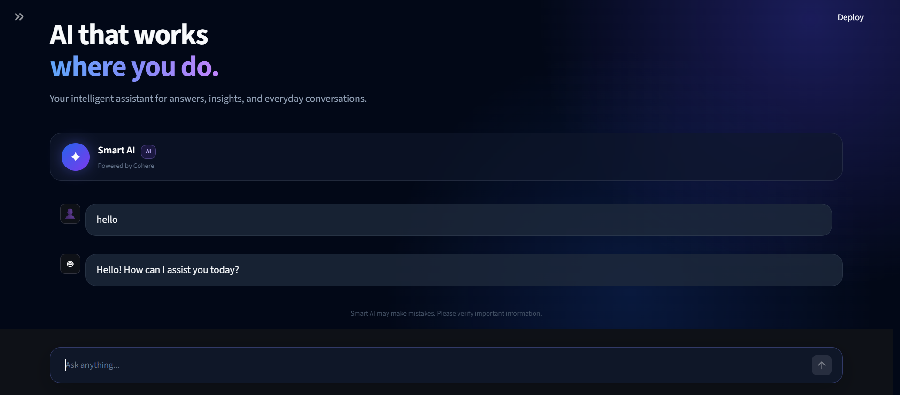

# Smart AI Chatbot

A Python chatbot that holds a multi-turn conversation with a real AI
provider (Cohere), with input validation, conversation history, and
graceful error handling. It ships with two front ends: a terminal
chat loop (`main.py`) and a Streamlit web UI (`app.py`).

## Features

- Real AI API integration (Cohere `command-a-03-2025` via the Cohere
  Python SDK)
- Prompt engineering: a fixed system prompt combined with the running
  conversation history
- Multi-turn conversation history, so follow-up questions have context
- Input validation (empty / whitespace-only input is rejected)
- Exit commands (`exit`, `quit`, `/exit`)
- Friendly error handling for missing/invalid credentials and
  network/API failures — the app never crashes on a failed request
- Credentials loaded from environment variables via `.env` (never
  hardcoded, never committed)
- Terminal UI and a Streamlit web UI, both built on the same core
  chatbot logic

## 📸 Streamlit App



## Architecture

```
User
 ↓
Chatbot Logic        (src/chatbot.py)   – input validation, exit handling,
 ↓                                        loop, error handling, display
Prompt / History      (src/prompts.py)   – builds provider messages from
 ↓                                        history + new input; appends
 ↓                                        new turns to history
API Client            (src/api_client.py)– talks to Cohere, parses the
 ↓                                        response, raises clean
 ↓                                        ValueError/RuntimeError on failure
AI Provider (Cohere)
 ↓
Response
 ↓
User
```

`main.py` and `app.py` are thin entry points: `main.py` drives the
terminal loop in `src/chatbot.py::run_chatbot`, and `app.py` (Streamlit)
reuses `src/chatbot.py::_get_bot_reply_result` directly so both front
ends share the exact same validation, prompt-building, and error-handling
logic.

## Project Structure

```
smart-ai-chatbot/
├── src/
│   ├── chatbot.py     # Conversation loop, validation, error handling
│   ├── api_client.py  # Cohere API integration
│   ├── prompts.py     # System prompt, message building, history updates
│   └── utils.py       # Text normalization, empty-input and exit checks
├── tests/
│   ├── chatbot_test.py   # Unit tests (validation, exit, single reply)
│   └── sanity_checks.py  # Integration-style tests (multi-turn history,
│                          # prompt structure, error paths) — all mocked,
│                          # no network/API key required
├── test_api.py         # OPTIONAL manual integration script that makes a
│                        # real call to Cohere (requires a real API key)
├── app.py               # Streamlit web UI
├── main.py               # Terminal entry point
├── requirements.txt
├── screenshoot_streamlit.png 
├── .env.example
├── .gitignore
├── test_plan.md
├── requirements_traceability.md
└── acceptance_checklist.md
```

## Technologies

- Python 3
- [Cohere Python SDK](https://pypi.org/project/cohere/) (`cohere.ClientV2`, model `command-a-03-2025`)
- `python-dotenv` for loading `.env`
- `streamlit` for the web UI
- `pytest` for automated tests

## Installation

```bash
git clone https://github.com/AhmedHesham633/Smart-AI-Chatbot.git
cd Smart-AI-Chatbot
python -m venv .venv
# Linux/macOS:
source .venv/bin/activate
# Windows:
.venv\Scripts\activate

pip install -r requirements.txt
```

## Environment Variables

Copy `.env.example` to `.env` and set your real key:

```
COHERE_API_KEY=your_api_key_here
```

`.env` is listed in `.gitignore` and must never be committed.

## Running the Application

Terminal chatbot:

```bash
python main.py
```

Streamlit web UI:

```bash
streamlit run app.py
```

## Example Usage (terminal)

```
You: What is machine learning?
Assistant: Machine learning is a field of AI where systems learn
patterns from data instead of being explicitly programmed.

You: Give me an example.
Assistant: Sure — spam email detection is a common example: the
system learns from labeled emails which ones are spam.

You: exit
Assistant: Goodbye! 👋
```

## Error Handling

- **Missing `COHERE_API_KEY`** → `api_client.generate_response` raises
  `ValueError`; the chatbot shows "Sorry, the AI service is not
  configured correctly..." and keeps running.
- **Invalid API key / API failure / network failure** → the Cohere SDK
  call fails, `api_client.generate_response` raises `RuntimeError`; the
  chatbot shows "Sorry, I couldn't reach the AI service..." and keeps
  running.
- **Empty provider response** → treated as a failed turn; the user sees
  a friendly message and history is not updated.
- **Any other unexpected exception** → caught by a final fallback
  handler so the app never crashes; a generic friendly message is shown.
- In every failure case, conversation history is **not** updated, so a
  failed turn cannot corrupt later prompts.

## Testing

Run all automated tests (no network or API key required — the Cohere
call is mocked):

```bash
pip install -r requirements.txt   # includes pytest
pytest tests/ -v
```

This runs both `tests/chatbot_test.py` (unit tests) and
`tests/sanity_checks.py` (integration-style, multi-turn, error-path
tests). See `test_plan.md` and `requirements_traceability.md` for the
full test case list and requirement-to-test mapping.

`test_api.py` at the project root is a separate, optional manual
script that makes one real call to the Cohere API — it requires a
valid `COHERE_API_KEY` and network access, and is not part of the
automated `pytest` run.

## Security

- Credentials are read only from environment variables
  (`os.getenv("COHERE_API_KEY")`), never hardcoded.
- `.env` is excluded from version control via `.gitignore`.
- `.env.example` contains a placeholder only.
- No API keys appear anywhere in source files, tests, or this README.

## Limitations

- Conversation history is kept in memory only; it is lost when the
  terminal app exits or the Streamlit session ends (no persistence to
  disk or a database).
- Only one provider (Cohere, `command-a-03-2025`) is supported; there
  is no provider-switching logic.
- No rate-limit-specific handling beyond the generic
  API-failure path — a rate-limit error is surfaced the same way as
  any other API failure.
- No authentication/user-accounts layer on the Streamlit UI; it is a
  single-session demo app.

## 👥 Team Members & Contributions

### 1. Ahmed Hesham — AI API Integration & Security

- Integrated the chatbot with the selected AI provider API.
- Implemented secure API key loading using environment variables.
- Configured `.env`, `.gitignore`, and `requirements.txt`.
- Implemented API request handling and response parsing.
- Added error handling for API, network, and authentication failures.
- Tested the API connection and provider responses.

### 2. Tukka Mohamed — Prompt Engineering & Conversation History

- Designed the chatbot's system prompt and prompt structure.
- Implemented prompt templates and message builders.
- Developed the conversation history structure.
- Integrated previous conversation context into follow-up requests.
- Implemented history updates after successful interactions.
- Tested multi-turn conversations and context handling.

### 3. Mariam Mohamed — Chatbot Logic, User Interaction & Streamlit UI

- Developed the main chatbot conversation loop.
- Implemented user input handling and validation.
- Added empty-input validation and exit commands.
- Connected the prompt/history module with the API client.
- Implemented response display and multi-turn interaction flow.
- Developed the Streamlit user interface for the chatbot.
- Integrated the chatbot backend with the Streamlit interface.
- Tested the complete user interaction flow through the UI.

### 4. Ghada Mohamed — Testing, Integration & Documentation

- Performed end-to-end testing of the chatbot.
- Tested normal questions, follow-up questions, empty inputs, and exit commands.
- Tested API errors and invalid credentials.
- Verified that `.env` and API credentials are properly secured.
- Performed final integration and code cleanup.
- Created and maintained the `README.md` documentation.
- Documented project setup, environment variables, usage, and examples.